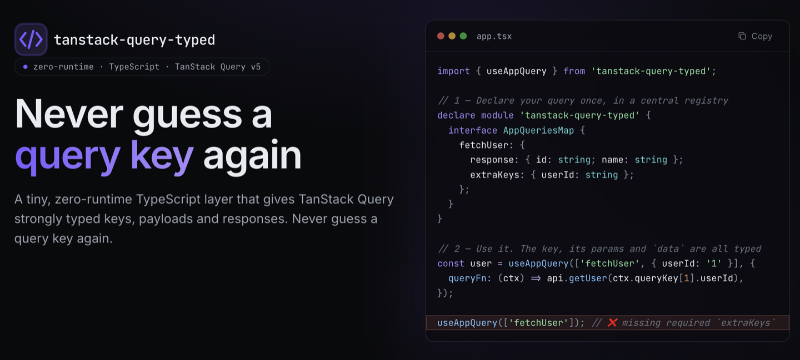

# tanstack-query-typed




A tiny, fully-typed layer over [TanStack Query](https://tanstack.com/query) that gives
**queries and mutations strongly typed keys, payloads and responses** — with zero runtime overhead.

[Website](https://apperside.github.io/tanstack-query-typed/) · [Live Playground](https://apperside.github.io/tanstack-query-typed/playground)

The hooks keep the **same names as TanStack Query** — `useQuery`, `useMutation`,
`useQueryClient`, `useIsFetching`, `useIsMutating`. Change only the import path
(`@tanstack/react-query` → `tanstack-query-typed`) and everything else about your
code stays the same — you just gain full typing.

You declare your queries and mutations once in two central registries; from then on
`useQuery`, `useMutation` and `useQueryClient` type-check the name, its
key segments, the variables passed to `mutate`, the data each one resolves to,
and every key-taking method of the `QueryClient`.

```ts
import { useQuery, useMutation } from 'tanstack-query-typed';
// ^ same names as @tanstack/react-query — only the import path changes

// Mutation
const updateUser = useMutation(['updateUser', { tenantId: 't-1' }], {
  mutationFn: (vars) => api.updateUser(vars),   // `vars` is fully typed
});
updateUser.mutate({ id: '1', name: 'Ada' });    // payload is type-checked,
                                                // `updateUser.data` is typed too

// Query
const user = useQuery(['fetchUser', { userId: '1' }], {
  queryFn: (ctx) => api.getUser(ctx.queryKey[1].userId), // `userId` is typed
});                                              // `user.data` is typed too
```

## Install

```sh
npm install tanstack-query-typed
```

`@tanstack/react-query` is a **peer dependency** (v5):

```sh
npm install @tanstack/react-query
```

This package is **ESM-only**.

## Usage

### 1. Register your queries and mutations

Augment the `AppMutationsRegistry` and `AppQueriesRegistry` interfaces via
[declaration merging](https://www.typescriptlang.org/docs/handbook/declaration-merging.html).
Put this somewhere that is part of your TypeScript program (e.g. `src/app-tanstack.d.ts`):

```ts
import 'tanstack-query-typed';

declare module 'tanstack-query-typed' {
  interface AppMutationsRegistry {
    updateUser: {
      payload: { id: string; name: string };
      response: { updatedAt: string };
      extraKeys: { tenantId: string };
    };
    logout: {
      payload: { reason?: string };
      response: { ok: true };
      // no `extraKeys` -> the key is just `['logout']`
    };
  }

  interface AppQueriesRegistry {
    fetchUser: {
      response: { id: string; name: string };
      extraKeys: { userId: string };
    };
    fetchSettings: {
      response: { theme: 'light' | 'dark' };
      // no `extraKeys` -> the key is just `['fetchSettings']`
    };
  }
}
```

**Mutation entry** — three fields:

| Field       | Meaning                                                                            | Default   |
| ----------- | ---------------------------------------------------------------------------------- | --------- |
| `payload`   | Variables for `mutationFn` / `mutate` / `mutateAsync`.                             | `void`    |
| `response`  | Data the mutation resolves to (the hook's `TData`).                                | `unknown` |
| `extraKeys` | Optional extra mutation-key segment. When present the key is `[name, extraKeys]`.  | (none)    |

**Query entry** — two fields (no `payload`: in TanStack Query a query's inputs **are**
its key, so anything that affects the result must live in `extraKeys`):

| Field       | Meaning                                                                                                | Default   |
| ----------- | ------------------------------------------------------------------------------------------------------ | --------- |
| `response`  | Data the query resolves to. Becomes the default `TQueryFnData` and `TData`.                            | `unknown` |
| `extraKeys` | Optional extra query-key segment. Part of cache identity AND visible to `queryFn` via `ctx.queryKey`.  | (none)    |

### 2. Use the hooks

```ts
import { useMutation, useQuery } from 'tanstack-query-typed';

function Example() {
  // --- Mutations --------------------------------------------------------------
  const updateUser = useMutation(['updateUser', { tenantId: 't-1' }], {
    mutationFn: (vars) => api.updateUser(vars),
  });
  const logout = useMutation(['logout'], {
    mutationFn: () => api.logout(),
  });
  updateUser.mutate({ id: '1', name: 'Ada' });

  // --- Queries ----------------------------------------------------------------
  // `ctx.queryKey[1]` is typed as the entry's `extraKeys`.
  const user = useQuery(['fetchUser', { userId: '1' }], {
    queryFn: (ctx) => api.getUser(ctx.queryKey[1].userId),
  });
  const settings = useQuery(['fetchSettings'], {
    queryFn: () => api.getSettings(),
  });

  // `select` narrows `data` while leaving `queryFn`'s return tied to the registry.
  const userName = useQuery(['fetchUser', { userId: '1' }], {
    queryFn: (ctx) => api.getUser(ctx.queryKey[1].userId),
    select: (data) => data.name, // `userName.data` becomes `string | undefined`
  });

  return null;
}
```

The compiler rejects mistakes:

```ts
useMutation(['updateUser']);                 // ❌ missing required `extraKeys`
useMutation(['logout', { tenantId: 't' }]);  // ❌ `logout` has no `extraKeys`
useMutation(['nope']);                        // ❌ unknown mutation name
updateUser.mutate({ id: 1, name: 'Ada' });       // ❌ `id` must be a string

useQuery(['fetchUser']);                      // ❌ missing required `extraKeys`
useQuery(['fetchSettings', { userId: 'x' }]); // ❌ `fetchSettings` has no `extraKeys`
useQuery(['nope']);                            // ❌ unknown query name
```

### 3. Use the typed `QueryClient`

`useQueryClient()` returns the current `QueryClient` typed against your
registries — every key-taking method (`getQueryData`, `setQueryData`,
`invalidateQueries`, `fetchQuery`, …) is narrowed to registered keys and the
registered response shape.

```ts
import { useQueryClient } from 'tanstack-query-typed';

function Example() {
  const qc = useQueryClient();

  // Read cached data — return type comes from `AppQueriesRegistry`.
  const user = qc.getQueryData(['fetchUser', { userId: '1' }]);
  //    ^? { id: string; name: string } | undefined

  // Optimistic update — `prev` is typed.
  qc.setQueryData(['fetchUser', { userId: '1' }], (prev) =>
    prev ? { ...prev, name: 'Ada' } : prev,
  );

  // Filter methods accept the full key OR just the `[name]` prefix.
  qc.invalidateQueries({ queryKey: ['fetchUser', { userId: '1' }] }); // exact
  qc.invalidateQueries({ queryKey: ['fetchUser'] });                  // by name

  // Imperative fetch — `ctx.queryKey` is the typed tuple, `queryFn`'s
  // return type must match the registered response.
  qc.fetchQuery({
    queryKey: ['fetchUser', { userId: '1' }],
    queryFn: (ctx) => api.getUser(ctx.queryKey[1].userId),
  });
}
```

For non-React contexts (e.g. building the client passed to
`QueryClientProvider`), `asTypedQueryClient(new QueryClient())` returns the
same client with the typed view.

The compiler rejects mistakes:

```ts
qc.getQueryData(['nope']);                              // ❌ unknown name
qc.invalidateQueries({ queryKey: ['nope'] });           // ❌ unknown name
qc.getQueryData(['fetchSettings', { userId: '1' }]);    // ❌ no `extraKeys`
```

**Methods that are typed:**

| Group                | Methods                                                                                  |
| -------------------- | ---------------------------------------------------------------------------------------- |
| Single `queryKey`    | `getQueryData`, `setQueryData`, `getQueryState`                                          |
| Filters              | `invalidateQueries`, `refetchQueries`, `removeQueries`, `resetQueries`, `cancelQueries`  |
| Counters             | `isFetching`, `isMutating`                                                               |
| Imperative fetches   | `fetchQuery`, `prefetchQuery`, `ensureQueryData`                                         |
| Mutation defaults    | `setMutationDefaults`, `getMutationDefaults`                                             |

**Methods that fall through untyped** (inherited as-is from `QueryClient`):

*No work needed — no keys involved.* These are already safe by design:
`mount`, `unmount`, `clear`, `resumePausedMutations`, `getQueryCache`,
`getMutationCache`, `getDefaultOptions`, `setDefaultOptions`,
`defaultQueryOptions`, `defaultMutationOptions`.

*Out of scope for this iteration — open an issue if you need them:*

| Method(s)                                                                       | Why it's not wrapped yet                                                                                                              |
| ------------------------------------------------------------------------------- | ------------------------------------------------------------------------------------------------------------------------------------- |
| `getQueriesData` / `setQueriesData`                                             | Filter-based cross-query reads/writes. A filter can match queries with different response shapes, so the return type would need to be a union over the registry. |
| `fetchInfiniteQuery` / `prefetchInfiniteQuery` / `ensureInfiniteQueryData`      | The registry has no pagination concept (no `pageParam` field on entries). Would need an `AppInfiniteQueriesMap` (or an opt-in flag on entries) to type these properly. |
| `setQueryDefaults` / `getQueryDefaults`                                         | Per-query defaults — lower priority than `setMutationDefaults` (which is already wrapped). Straightforward to add when needed.        |

### 4. Count in-flight queries and mutations

`useIsFetching` and `useIsMutating` mirror TanStack's hooks of the same name and
return a `number`. The filter key is checked against your registries — pass the
full key or just the `[name]` prefix.

```ts
import { useIsFetching, useIsMutating } from 'tanstack-query-typed';

function Example() {
  const anyFetching = useIsFetching();                              // all queries
  const fetchingUser = useIsFetching({ queryKey: ['fetchUser'] });  // by name
  const fetchingOne = useIsFetching({
    queryKey: ['fetchUser', { userId: '1' }],                       // exact key
  });

  const anyMutating = useIsMutating();                              // all mutations
  const savingUser = useIsMutating({ mutationKey: ['updateUser'] }); // by name

  return anyFetching + fetchingUser + fetchingOne + anyMutating + savingUser;
}
```

The compiler rejects mistakes:

```ts
useIsFetching({ queryKey: ['nope'] });     // ❌ unknown query name
useIsMutating({ mutationKey: ['nope'] });  // ❌ unknown mutation name
```

## API

### `useMutation(mutationKey, options?)`

A drop-in wrapper around TanStack's `useMutation`. The signature mirrors TanStack's, except:

- `mutationKey` is the **first argument** and is typed as `[name]` or `[name, extraKeys]`.
- `options` is the usual `UseMutationOptions` **without** `mutationKey`.
- `TData` defaults to the entry's `response`, and the variables type to its `payload`.
  Both remain overridable via the generic parameters when you need to.

Returns the standard `UseMutationResult`.

### `useQuery(queryKey, options?)`

A drop-in wrapper around TanStack's `useQuery`. Same conventions:

- `queryKey` is the **first argument** and is typed as `[name]` or `[name, extraKeys]`.
- `options` is the usual `UseQueryOptions` **without** `queryKey`.
- `TQueryFnData` defaults to the entry's `response`; `TData` defaults to `TQueryFnData`
  and is narrowed by `select` when provided.
- Inside `queryFn`, `ctx.queryKey` is the precise tuple — `ctx.queryKey[1]` is typed
  as the entry's `extraKeys`.

Returns the standard `UseQueryResult`.

### `useQueryClient(queryClient?)` / `asTypedQueryClient(client)`

A React hook (and a plain cast helper, for non-React contexts) that returns
the current `QueryClient` typed as `TypedQueryClient`. Both are zero-runtime:
the cast compiles away, the hook just calls TanStack's `useQueryClient`.

The `TypedQueryClient` type is `QueryClient` with every key-taking method
overridden to accept only registered keys and to return the registered
response shape. See the *Use the typed QueryClient* section above for the
full list of covered methods.

### `useIsFetching(filters?, queryClient?)` / `useIsMutating(filters?, queryClient?)`

React hooks that mirror TanStack's `useIsFetching` / `useIsMutating` and return
the `number` of matching in-flight queries / mutations. The only difference is
that the filter key is typed against your registries:

- `useIsFetching` — `filters.queryKey` is a registered query key or its `[name]` prefix.
- `useIsMutating` — `filters.mutationKey` is a registered mutation key or its `[name]` prefix.

Both take the same optional second `queryClient` argument as TanStack, to read
from a specific client instead of the context one.

### Exported types

Mutations: `AppMutationsRegistry`, `AppMutationKey<K>`,
`AppMutationOptions<K, TData, TError, TContext>`, `MutationPayload<K>`,
`MutationResponse<K>`, `MutationExtraKeys<K>`.

Queries: `AppQueriesRegistry`, `AppQueryKey<K>`,
`AppQueryOptions<K, TQueryFnData, TError, TData>`, `QueryResponse<K>`,
`QueryExtraKeys<K>`.

QueryClient: `TypedQueryClient`,
`AppMutationFilters<TData, TError, TVariables, TContext>`.

Registry-wide unions: `AnyAppMutationKey`, `AnyAppQueryKey`,
`AppMutationKeyOrPrefix`, `AppQueryKeyOrPrefix`.

## Develop

```sh
npm install       # install dev dependencies
npm run typecheck # type-check src + examples + tests (all type-level)
npm run build     # emit ESM + .d.ts to dist/ via tsup (uses tsconfig.build.json)
```

The root `tsconfig.json` is the **IDE / type-check** config — it includes
`src/`, `examples/`, `tests/`, and aliases `tanstack-query-typed` →
`src/index.ts` so the type tests can self-reference the package name. `tsup`
builds against a separate minimal `tsconfig.build.json` (no path aliases, no
`baseUrl`) so `.d.ts` generation isn't affected by the alias.

### Type tests

This library has no runtime tests — the only thing worth testing here is the
typing, so tests are pure compile-time assertions checked by `tsc --noEmit`:

- `tests/fixtures.ts` registers the shared test fixtures (mutation + query
  entries used across the suite). Global module-augmentation merging makes
  them visible from every `*.test-d.ts` file without an explicit import.
- `tests/mutations.test-d.ts`, `tests/queries.test-d.ts`,
  `tests/queryClient.test-d.ts` — one file per surface, each using
  [`expect-type`](https://github.com/mmkal/expect-type) for **positive**
  assertions (`expectTypeOf<X>().toEqualTypeOf<Y>()`).
- `examples/usage.ts` uses `@ts-expect-error` for **negative** assertions —
  TypeScript fails the directive if the misuse stops being an error, so each
  line doubles as a test that misuse is rejected.

Everything runs under `npm run typecheck`. Nothing in `tests/` or `examples/`
is shipped in the package.

## License

[MIT](./LICENSE)
